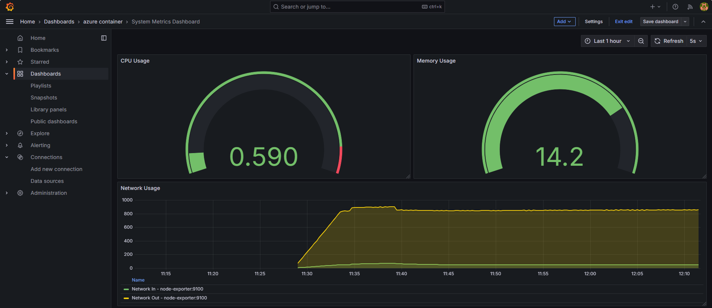

# AirTicket Application Deployment

This project demonstrates a complete CI/CD pipeline for deploying a frontend and backend application to Azure.
The applications are containerized using Docker and deployed to Azure Container Instances (ACI) via Azure Container Registry (ACR).
The pipeline automates the process of building, testing, containerizing, and deploying the applications, ensuring a seamless and efficient workflow.
This setup includes local testing, Azure integration, and automation using Jenkins for continuous integration and deployment..

---

## Table of Contents

1. Containerization with Docker
2. Automation with Jenkins
3. Create Azure ACR
4. Deploy to Azure Container Instances (ACI)
   
   # Deploy ACI for Backend:
     az container create \
       --resource-group AirTicketResourceGroup \
       --name airticket-backend \
       --image airticketregistry.azurecr.io/airticket-backend:latest \
       --cpu 1 \
       --memory 1.5 \
       --ports 5000 \
       --ip-address Public

   # Deploy ACI for Frontend:
     az container create \
       --resource-group AirTicketResourceGroup \
       --name airticket-frontend \
       --image airticketregistry.azurecr.io/airticket-frontend:latest \
       --cpu 1 \
       --memory 1.5 \
       --ports 3000 \
       --ip-address Public

5. Monitoring with Grafana \
   npm install prom-client \
   

   

